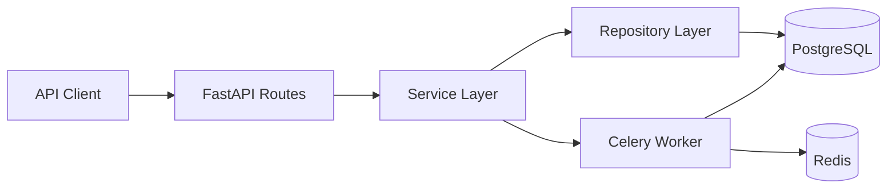

# Job Application Tracker API


A production-style FastAPI backend for tracking job applications, follow-ups,
notes, and hiring pipeline analytics. It is designed like a small SaaS backend
for developers applying to remote roles, startup jobs, and freelance projects.

The project focuses on real backend patterns: JWT authentication, user-scoped
data access, repository and service layers, async SQLAlchemy 2.0, Alembic
migrations, Redis-backed Celery workers, Docker, CI, and automated tests.

## Tech Stack

- Python 3.11+
- FastAPI and Pydantic
- PostgreSQL with SQLAlchemy 2.0 async sessions
- Alembic migrations
- Redis and Celery for reminder jobs
- Pytest, Ruff, and Black
- Docker and Docker Compose
- GitHub Actions CI

## Product Features

- User registration, login, JWT access tokens, and current-user endpoint
- Job application CRUD with company, title, URL, salary range, status, source,
  remote type, notes, applied date, and follow-up date
- Application notes with author and timestamps
- Follow-up reminders with a background worker and due-reminder endpoint
- Analytics for totals, status breakdowns, source breakdowns, salary averages,
  upcoming follow-ups, and recent activity
- Filtering by status, source, remote type, and search query
- Sorting by created date, applied date, follow-up date, and salary
- Pagination for application lists
- User ownership checks across applications, notes, and reminders
- Clean OpenAPI documentation at `/docs`

## Architecture



The route layer handles HTTP concerns, validation, and response models. Services
own business workflows such as syncing reminders when a follow-up date changes.
Repositories keep database access isolated and testable.

## API Overview

| Method | Endpoint | Description |
| --- | --- | --- |
| `POST` | `/api/v1/auth/register` | Register a user |
| `POST` | `/api/v1/auth/login` | Login and receive a JWT |
| `GET` | `/api/v1/auth/me` | Return the authenticated user |
| `POST` | `/api/v1/applications` | Create an application |
| `GET` | `/api/v1/applications` | List, filter, search, and sort applications |
| `GET` | `/api/v1/applications/{id}` | View a single application |
| `PATCH` | `/api/v1/applications/{id}` | Update an application |
| `DELETE` | `/api/v1/applications/{id}` | Delete an application |
| `POST` | `/api/v1/applications/{id}/notes` | Add an application note |
| `GET` | `/api/v1/applications/{id}/notes` | List application notes |
| `PATCH` | `/api/v1/notes/{id}` | Update a note |
| `DELETE` | `/api/v1/notes/{id}` | Delete a note |
| `GET` | `/api/v1/reminders/due` | List due follow-up reminders |
| `PATCH` | `/api/v1/reminders/{id}/complete` | Mark a reminder complete |
| `GET` | `/api/v1/analytics/overview` | Pipeline overview metrics |
| `GET` | `/api/v1/analytics/by-status` | Applications grouped by status |
| `GET` | `/api/v1/analytics/by-source` | Applications grouped by source |

## Example Requests

Register a user:

```bash
curl -X POST http://localhost:8000/api/v1/auth/register \
  -H "Content-Type: application/json" \
  -d '{
    "email": "alex@example.com",
    "password": "SecurePass123!",
    "full_name": "Alex Remote"
  }'
```

Create an application:

```bash
curl -X POST http://localhost:8000/api/v1/applications \
  -H "Authorization: Bearer <token>" \
  -H "Content-Type: application/json" \
  -d '{
    "company_name": "Acme Labs",
    "job_title": "Backend Engineer",
    "job_url": "https://jobs.example.com/acme/backend",
    "location": "Berlin",
    "remote_type": "remote",
    "salary_min": 85000,
    "salary_max": 120000,
    "currency": "EUR",
    "status": "applied",
    "source": "Wellfound",
    "applied_at": "2026-04-20",
    "follow_up_date": "2026-04-28"
  }'
```

Filter the pipeline:

```bash
curl "http://localhost:8000/api/v1/applications?status=interview&search=backend&sort_by=follow_up_date" \
  -H "Authorization: Bearer <token>"
```

Analytics response:

```json
{
  "total_applications": 18,
  "applications_created_this_week": 5,
  "applications_created_this_month": 14,
  "upcoming_follow_ups": 4,
  "average_salary_min": 82000.0,
  "average_salary_max": 126000.0
}
```

## Local Setup

Create a virtual environment and install dependencies:

```bash
python -m venv .venv
.venv\Scripts\activate
python -m pip install --upgrade pip
pip install -e ".[dev]"
```

Create your local environment file:

```bash
copy .env.example .env
```

Run migrations and start the API:

```bash
alembic upgrade head
uvicorn app.main:app --reload
```

Open:

- API docs: `http://localhost:8000/docs`
- Health check: `http://localhost:8000/health`

## Docker Setup

Run the full stack with API, PostgreSQL, Redis, and worker:

```bash
make dev
```

The API starts on `http://localhost:8000`. Docker Compose runs Alembic before
starting the API container.

## Testing and Quality

```bash
make lint
make test
```

The CI workflow runs Ruff, Black, and Pytest on every push and pull request.

## Background Jobs

Celery uses Redis as broker and result backend. The worker includes a scheduled
task that checks for due follow-up reminders and writes structured log events.

```bash
celery -A app.workers.celery_app.celery_app worker --loglevel=INFO
```

## Folder Structure

```text
app/
  api/routes/       REST route modules
  core/             configuration, security, exceptions, logging
  db/               SQLAlchemy base and async session
  models/           SQLAlchemy ORM models
  repositories/     database access layer
  schemas/          Pydantic request and response schemas
  services/         business logic and orchestration
  workers/          Celery app and reminder jobs
tests/              pytest test suite
alembic/            migration environment and versions
.github/workflows/  CI pipeline
```

## Why This Is Useful

Job seekers often manage opportunities across multiple platforms, interview
stages, notes, salary expectations, and follow-up dates. This API demonstrates
the backend shape a real product would need: authenticated user data, pipeline
workflows, reminders, analytics, clean boundaries, and a deployable dev stack.
