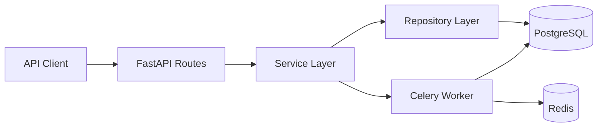
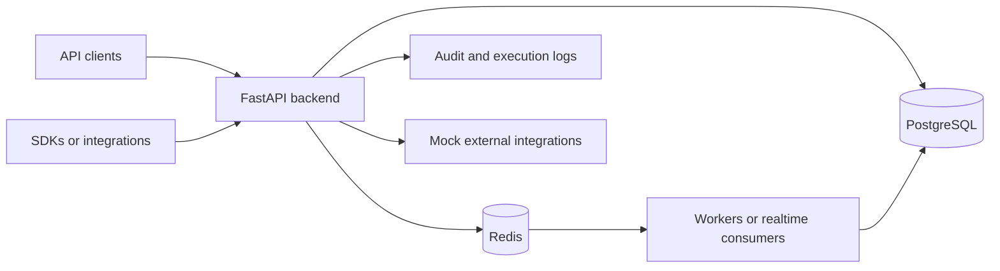
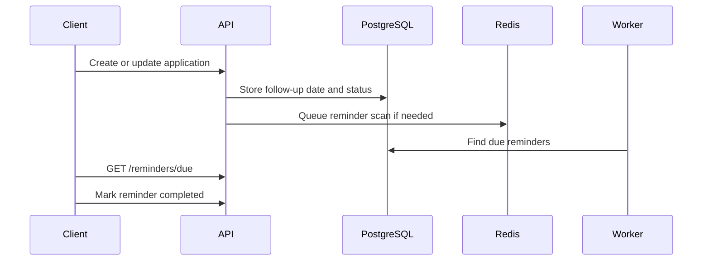

# Job Application Tracker API


A production-style FastAPI backend for tracking job applications, follow-ups,
notes, and hiring pipeline analytics. It is designed like a small SaaS backend
for developers applying to remote roles, startup jobs, and freelance projects.

The project focuses on real backend patterns: JWT authentication, user-scoped
data access, repository and service layers, async SQLAlchemy 2.0, Alembic
migrations, Redis-backed Celery workers, Docker, CI, and automated tests.

## Tech Stack

- Python 3.11+
- FastAPI and Pydantic
- PostgreSQL with SQLAlchemy 2.0 async sessions
- Alembic migrations
- Redis and Celery for reminder jobs
- Pytest, Ruff, and Black
- Docker and Docker Compose
- GitHub Actions CI

## Product Features

- User registration, login, JWT access tokens, and current-user endpoint
- Job application CRUD with company, title, URL, salary range, status, source,
  remote type, notes, applied date, and follow-up date
- Application notes with author and timestamps
- Follow-up reminders with a background worker and due-reminder endpoint
- Analytics for totals, status breakdowns, source breakdowns, salary averages,
  upcoming follow-ups, and recent activity
- Filtering by status, source, remote type, and search query
- Sorting by created date, applied date, follow-up date, and salary
- Pagination for application lists
- User ownership checks across applications, notes, and reminders
- Clean OpenAPI documentation at `/docs`

## Architecture



The route layer handles HTTP concerns, validation, and response models. Services
own business workflows such as syncing reminders when a follow-up date changes.
Repositories keep database access isolated and testable.

## API Overview

| Method | Endpoint | Description |
| --- | --- | --- |
| `POST` | `/api/v1/auth/register` | Register a user |
| `POST` | `/api/v1/auth/login` | Login and receive a JWT |
| `GET` | `/api/v1/auth/me` | Return the authenticated user |
| `POST` | `/api/v1/applications` | Create an application |
| `GET` | `/api/v1/applications` | List, filter, search, and sort applications |
| `GET` | `/api/v1/applications/{id}` | View a single application |
| `PATCH` | `/api/v1/applications/{id}` | Update an application |
| `DELETE` | `/api/v1/applications/{id}` | Delete an application |
| `POST` | `/api/v1/applications/{id}/notes` | Add an application note |
| `GET` | `/api/v1/applications/{id}/notes` | List application notes |
| `PATCH` | `/api/v1/notes/{id}` | Update a note |
| `DELETE` | `/api/v1/notes/{id}` | Delete a note |
| `GET` | `/api/v1/reminders/due` | List due follow-up reminders |
| `PATCH` | `/api/v1/reminders/{id}/complete` | Mark a reminder complete |
| `GET` | `/api/v1/analytics/overview` | Pipeline overview metrics |
| `GET` | `/api/v1/analytics/by-status` | Applications grouped by status |
| `GET` | `/api/v1/analytics/by-source` | Applications grouped by source |

## Example Requests

Register a user:

```bash
curl -X POST http://localhost:8000/api/v1/auth/register \
  -H "Content-Type: application/json" \
  -d '{
    "email": "alex@example.com",
    "password": "SecurePass123!",
    "full_name": "Alex Remote"
  }'
```

Create an application:

```bash
curl -X POST http://localhost:8000/api/v1/applications \
  -H "Authorization: Bearer <token>" \
  -H "Content-Type: application/json" \
  -d '{
    "company_name": "Acme Labs",
    "job_title": "Backend Engineer",
    "job_url": "https://jobs.example.com/acme/backend",
    "location": "Berlin",
    "remote_type": "remote",
    "salary_min": 85000,
    "salary_max": 120000,
    "currency": "EUR",
    "status": "applied",
    "source": "Wellfound",
    "applied_at": "2026-04-20",
    "follow_up_date": "2026-04-28"
  }'
```

Filter the pipeline:

```bash
curl "http://localhost:8000/api/v1/applications?status=interview&search=backend&sort_by=follow_up_date" \
  -H "Authorization: Bearer <token>"
```

Analytics response:

```json
{
  "total_applications": 18,
  "applications_created_this_week": 5,
  "applications_created_this_month": 14,
  "upcoming_follow_ups": 4,
  "average_salary_min": 82000.0,
  "average_salary_max": 126000.0
}
```

## Local Setup

Create a virtual environment and install dependencies:

```bash
python -m venv .venv
.venv\Scripts\activate
python -m pip install --upgrade pip
pip install -e ".[dev]"
```

Create your local environment file:

```bash
copy .env.example .env
```

Run migrations and start the API:

```bash
alembic upgrade head
uvicorn app.main:app --reload
```

Open:

- API docs: `http://localhost:8000/docs`
- Health check: `http://localhost:8000/health`

## Docker Setup

Run the full stack with API, PostgreSQL, Redis, and worker:

```bash
make dev
```

The API starts on `http://localhost:8000`. Docker Compose runs Alembic before
starting the API container.

## Testing and Quality

```bash
make lint
make test
```

The CI workflow runs Ruff, Black, and Pytest on every push and pull request.

## Background Jobs

Celery uses Redis as broker and result backend. The worker includes a scheduled
task that checks for due follow-up reminders and writes structured log events.

```bash
celery -A app.workers.celery_app.celery_app worker --loglevel=INFO
```

## Folder Structure

```text
app/
  api/routes/       REST route modules
  core/             configuration, security, exceptions, logging
  db/               SQLAlchemy base and async session
  models/           SQLAlchemy ORM models
  repositories/     database access layer
  schemas/          Pydantic request and response schemas
  services/         business logic and orchestration
  workers/          Celery app and reminder jobs
tests/              pytest test suite
alembic/            migration environment and versions
.github/workflows/  CI pipeline
```

## Why This Is Useful

Job seekers often manage opportunities across multiple platforms, interview
stages, notes, salary expectations, and follow-up dates. This API demonstrates
the backend shape a real product would need: authenticated user data, pipeline
workflows, reminders, analytics, clean boundaries, and a deployable dev stack.

<!-- lead-level-notes:start -->

## Lead-Level Architecture Notes

### Problem

People applying to many roles need more than a spreadsheet. They need structured status tracking, notes, follow-up reminders, search, and analytics without leaking personal job data across users.

### Solution

The API models applications, notes, reminders, filtering, sorting, and analytics around a user-owned workspace. Background reminder checks keep follow-up workflows separate from request handling, and the service layer keeps analytics and permission logic testable.

### Architecture Overview

This is a portfolio/simulation project, but it is structured around the same boundaries a production team would care about:

- Frontend/client: External clients or frontend apps.
- Backend API: FastAPI routes stay thin and delegate business rules to services.
- Database: PostgreSQL is the source of truth for relational state, ownership, and auditability.
- Redis: Used where the project needs queues, Pub/Sub, cache-ready paths, or rate-limit-ready primitives.
- Background jobs: Reminder scanning belongs outside the request path. Production would track job runs, missed windows, and user-specific time zones.
- Integrations: Mock providers are kept behind service boundaries so real vendors can be added without changing API contracts.
- Runtime flow: Requests validate identity and tenant access first, then call services that persist state, emit logs, and enqueue async work when needed.

Key components:

- FastAPI application management API
- PostgreSQL for applications, notes, reminders, and analytics state
- Redis broker for reminder jobs
- Worker process for due follow-up checks
- JWT authentication and per-user data ownership
- Pagination, filtering, search, and sorting

### Mermaid Diagrams

#### System Overview



#### Reminder Flow



### Lead-Level Engineering Decisions

- FastAPI keeps the API surface explicit, typed, and easy to document through OpenAPI.
- PostgreSQL is used for durable relational state because the core domain depends on ownership, filtering, constraints, and audit history.
- Service and repository layers keep route handlers small and make permission checks, workflows, and business rules easier to test.
- Redis is used for lightweight async coordination, Pub/Sub, cache-ready access patterns, or rate limiting depending on the product shape.
- Pydantic schemas define clear input/output contracts and avoid leaking ORM details into HTTP responses.
- Docker Compose keeps the local runtime close to a real deployment without hiding the moving parts.
- The project would need Kafka or another event stream when message volume, replay, ordering, or cross-service consumers outgrow Redis queues or Pub/Sub.
- Kubernetes would make sense once multiple API/worker replicas, autoscaling, secrets management, and rollout strategy become operational concerns.
- Object storage becomes necessary when user-uploaded files, exports, or artifacts should not live on local disk.

### Production Considerations

- Rate limiting should be applied to authentication, public ingestion, webhook, and API-key protected endpoints.
- Important POST endpoints should support idempotency keys when clients may retry after timeouts.
- Workers should record retry attempts, terminal failures, and enough context for support/debugging.
- Structured logging should include request IDs, actor IDs, tenant/workspace IDs, and resource IDs where safe.
- Health checks should distinguish process health from dependency readiness for database, Redis, and workers.
- Error responses should stay consistent and avoid leaking internal exception details.
- Pagination and filtering should be mandatory for list endpoints that can grow with customer usage.
- Validation should happen at the API boundary and again inside domain services for sensitive state transitions.
- Audit logs should be append-only from the application's point of view and easy to filter by actor/action/resource.

### Security Considerations

- JWT secrets and database credentials belong in environment variables or a secret manager, never in source code.
- Passwords should be hashed with a slow password hashing algorithm and never logged.
- API keys should be shown only once, stored hashed, scoped to the smallest useful surface, and revocable.
- RBAC or workspace membership checks should happen before returning or mutating tenant-owned resources.
- Tenant/workspace isolation should be tested with explicit cross-tenant access attempts.
- Input validation should cover request bodies, path parameters, uploaded files, and integration payloads.
- Safe defaults matter: deny by default, keep production actions stricter, and prefer explicit allow lists.
- The most important security boundary in this project is strict user ownership for applications, notes, and reminders.

### Observability

- Request logs should capture method, path, status, latency, and correlation ID.
- Domain logs should capture state transitions such as queued, processing, completed, failed, revoked, or retried.
- Audit logs explain who changed what and when.
- Metrics/analytics endpoints provide a product-facing view of usage, failure rates, and operational health.
- `/health` gives a basic load balancer check; production would add dependency checks and build/version metadata.
- Error tracking can be mocked locally, but production should send exceptions to Sentry or a similar system.
- Realtime log streams, where present, are for operator feedback and should not replace persisted logs.

### Scaling Strategy

- MVP: one API instance, one PostgreSQL database, one Redis instance, and one worker process is enough to validate the product shape.
- Next step: run multiple API replicas, separate worker queues by workload, and add indexes for tenant ID, status, timestamps, and foreign keys.
- Caching: cache read-heavy reference data carefully and keep invalidation tied to writes or versioned configs.
- Queues: keep short jobs on Redis; move to Kafka, Redpanda, or a managed queue when replay, ordering, or long retention are needed.
- Database: use connection pooling, query plans, and read replicas before introducing unnecessary data stores.
- Horizontal scaling should preserve tenant isolation, idempotency, and clear ownership of background jobs.
- This system would most likely need a stronger event backbone when large reminder volume or shared team recruiting workflows.

### Future Improvements

- Add calendar integrations
- Add email import and parsing
- Add idempotency for browser extensions or job board imports
- Kubernetes manifests or Helm charts once runtime topology matters.
- OpenTelemetry traces across API, workers, database calls, and external integrations.
- Sentry or another error tracker for production exception triage.
- Prometheus and Grafana dashboards for latency, queue depth, throughput, and failure rates.
- More contract and integration tests around permission boundaries and failure paths.

<!-- lead-level-notes:end -->
